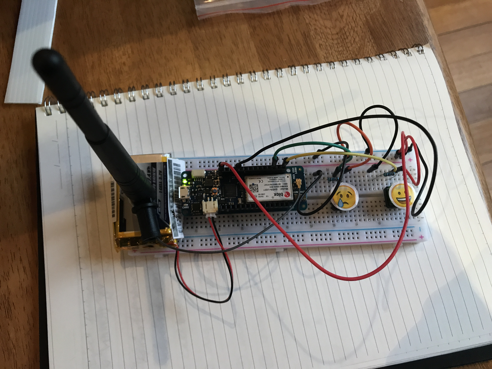

# Sloane-Phone-Arduino



See the [Sloane Phone Node Repo](https://github.com/nikkiricks/Sloane-Phone-Node) for background and inspiration for the project.

This project used the [Arduino MKR GSM 1400 board](https://store.arduino.cc/usa/mkr-gsm-1400). It's neccessary to have all of the parts listed for the board and sketch to work.

## Technology Used

This cannot be run from your terminal, you'll need the [Arduino IDE](https://www.arduino.cc/en/main/software) for this project.

## Parts

| Part                                                      | Source                                                                                                                                                                                                                                                                                                                                                                                                                                                                              |    Price |
| --------------------------------------------------------- | ----------------------------------------------------------------------------------------------------------------------------------------------------------------------------------------------------------------------------------------------------------------------------------------------------------------------------------------------------------------------------------------------------------------------------------------------------------------------------------- | -------: |
| ARDUINO MKR GSM 1400                                      | [Arduino Website](https://store.arduino.cc/usa/mkr-gsm-1400)                                                                                                                                                                                                                                                                                                                                                                                                                        |  \$69.90 |
| Two buttons, wires, resistors from - Freenove Starter Kit | [Freenove Starter Kit](https://www.amazon.com.au/Freenove-Processing-Oscilloscope-Voltmeter-Components/dp/B0721B8228/ref=sr_1_1?keywords=freenove+arduino+uno+starter+kit&qid=1576150765&s=electronics&sr=1-1)                                                                                                                                                                                                                                                                      |     \$34 |
| Antenna (mine was given to me but this would work)        | [RS](https://au.rs-online.com/web/p/wifi-antennas/9076510?ef_id=CjwKCAjwmKLzBRBeEiwACCVihg-3Q-KJ53kU4h5uOO2kNa3vcs6J8YKZawazskT80m93cvUPBpy6LhoCbY4QAvD_BwE:G:s&s_kwcid=AL!8733!3!99325714834!!!g!443370683741!&cm_mmc=AU-PLA-DS3A-_-google-_-PLA_AU_EN_Computing_And_Peripherals-_-Keyboards_And_Mice-_-PRODUCT_GROUP&matchtype=&aud-827186183886:pla-443370683741&gclid=CjwKCAjwmKLzBRBeEiwACCVihg-3Q-KJ53kU4h5uOO2kNa3vcs6J8YKZawazskT80m93cvUPBpy6LhoCbY4QAvD_BwE&gclsrc=aw.ds) |   \$4.72 |
| Turnigy 2000mAh Battery                                   | [Hobby King](https://hobbyking.com/en_us/turnigy-2000mah-1s-1c-lipoly-w-2-pin-jst-ph-connector.html?___store=en_us)                                                                                                                                                                                                                                                                                                                                                                 |   \$7.60 |
| Aldi SIM Card                                             | [Aldi](https://www.aldimobile.com.au/checkout)                                                                                                                                                                                                                                                                                                                                                                                                                                      |   \$5.00 |
|                                                           | **_TOTAL_**                                                                                                                                                                                                                                                                                                                                                                                                                                                                         | \$121.22 |

### Software Sketch Referenced

- Tom Igoe Sketch for MKR-GSM
- Debounce sketch

## Getting started

- Download the [Arduino IDE](https://www.arduino.cc/en/main/software)
- Copy and paste the mkr-gsm.c code into the Arduino IDE
- Create another tab and label it arduino_secrets.h. Enter in the pin for the SIM card in quotes example:

```
#define SECRET_PINNUMBER "8493"
```

- Wire bread board so the buttons are inserted into "6" and "8" inputs.
- Enter in the phone number that you want to text with the country code. Note that some countries have a 0 at the front of the number and the sketch uses it without that 0.
- Verify your code by clicking the check mark
- Upload your code by clicking the right arrow
- Open your serial monitor by clicking the magnifying glass to check if your sketch uploaded correctly and read any error messages
- Make the button yours and swap out the mesages you would like to send!
